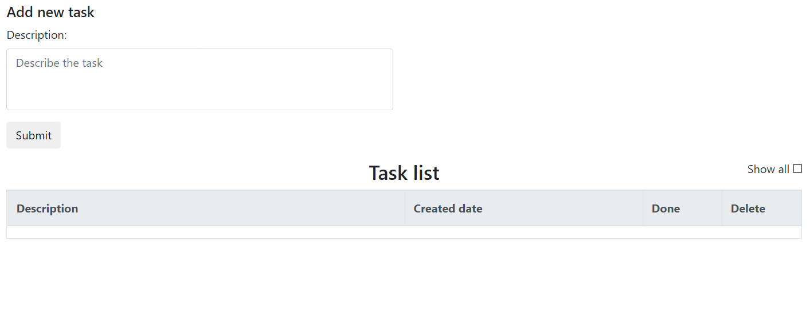
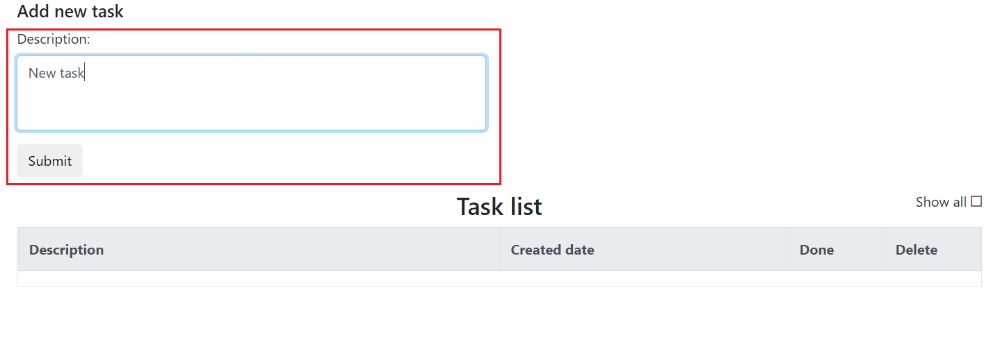
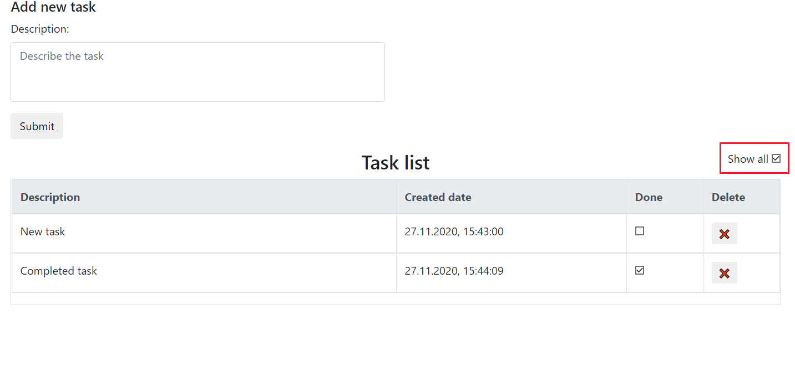

# To-do list

Simple todo app

# About the project

#### Technologies:
+ PostgreSQL
+ Jackson
+ Servlet 4.0
+ Hibernate
+ Bootstrap 4
+ JQuery
+ HTML

#### App interface

+ __Main app space__

+ __Add a new task__

+ __Show all tasks__

# Deployment

#### Required tools:
+ Tomcat
+ Maven
+ PostgreSQL
#### Steps:
+ Copy the project from github
+ Go to the root directory of the project
+ Execute the command `mvn clean package -DskipTests=true`
+ Go to the `target` directory
+ Copy the created file with the *.war extension (must be "todolist-1.0.war") to the `webapps` directory in Tomcat
+ Database connection settings are in the file `webapps\todolist-1.0\WEB-INF\classes\hibernate.cfg.xml`  
Default settings:  
    + `url=jdbc:postgresql://localhost:5432/todolist`  
    + `username=postgres`  
    + `password=postgrespass`
+ Start Tomcat Server

# Contact

Telegram: https://t.me/IvanPJF